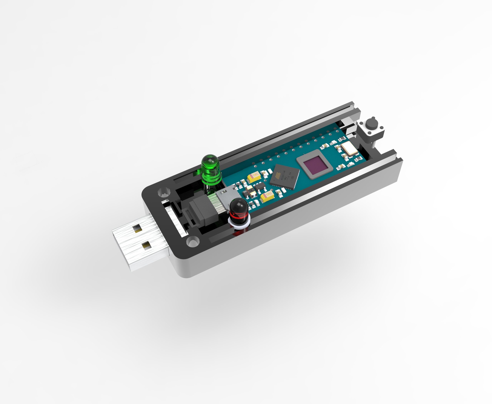
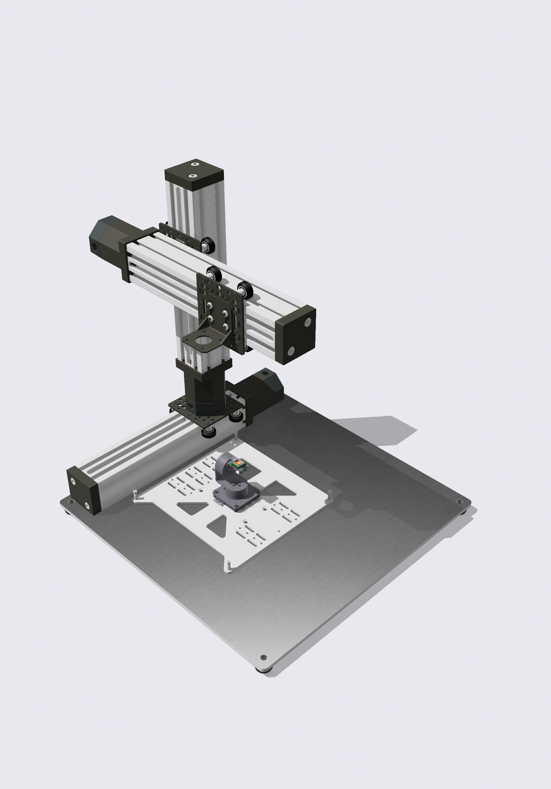

  

# Lazeal OptiX

<!-- 

  
   

 -->

<table width="100%">
  <tr>
    <td align="center" valign="middle" width="50%">
      
    </td>
    <td align="center" valign="middle" width="50%">
       
    </td>
  </tr>
</table>

<!--  | | |
|:---:|:---:|
|  |  |
| *Prototype for Individuals* | *Prototype for Institutions* | -->

*Prototype for Individual Use (left) and Institutional Use (right)*

## Project Overview
Lazeal OptiX is an innovative healthcare technology project. The core of the project is the development of a device that offers advanced diagnostics to users in the comfort of their homes. Using advanced microscopy and biochemical analysis techniques, the device aims to facilitate the early detection of a variety of health issues, contributing to improved healthcare outcomes.

The Lazeal OptiX project is born out of a commitment to reducing suffering and making health diagnostics more accessible to all. By equipping individuals with the tools they need to take control of their health, we strive to help create a healthier society.

## Features
1. **Advanced Microscopy:** Leveraging advanced microscopy techniques for detailed analysis.
2. **Biochemical Analysis:** In-depth biochemical analysis enables detection of various health indicators.
3. **User-Friendly:** Designed for home use, offering a simple and accessible user interface.
4. **Compact and Affordable:** Lazeal OptiX is compact and affordably priced, bringing advanced diagnostics to everyday users.

## Getting Involved
We welcome collaboration and contributions. If you're interested in getting involved with the Lazeal OptiX project, feel free to submit an issue or a pull request, or contact us directly.

## Notebooks

The notebooks directory contains Jupyter notebooks that document various aspects of the Lazeal OptiX project. These notebooks include code, visualizations, and detailed explanations of the project's methodologies. They serve as an interactive way to explore and understand the project.

### light_source_location
The light_source_location directory contains notebooks related to the estimation of light source locations. These notebooks feature algorithms and methods used to accurately estimate the position of the light source, which is a crucial aspect of the Lazeal OptiX project.

### multiple_match
The multiple_match directory contains notebooks and scripts related to the matching of multiple images or patterns. This part of the project involves complex algorithms to accurately match and align images, which is necessary for the reconstruction of high-resolution images from the lensless imaging system.

### reconstruction
The reconstruction directory contains notebooks related to the reconstruction of images captured by the Lazeal OptiX device. These notebooks document the advanced computational techniques used to reconstruct high-resolution images from the lensless imaging system.

## Contact
For further inquiries or collaboration interests, please reach out at contact@lazealoptix.com.
