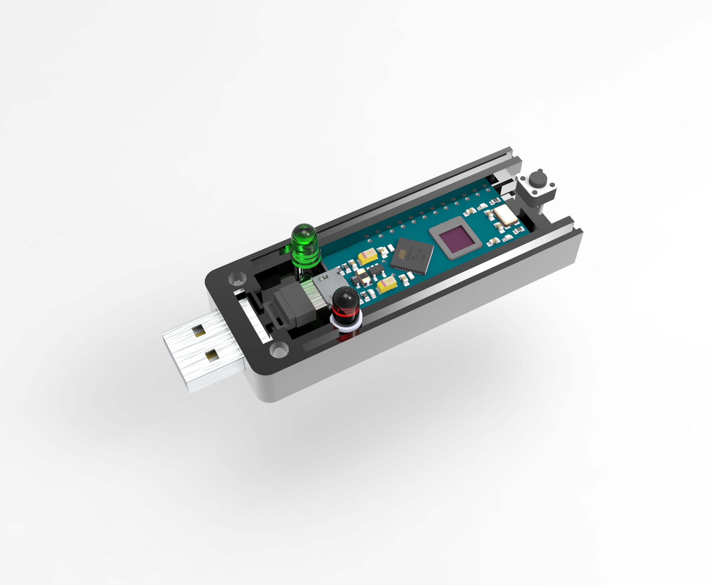
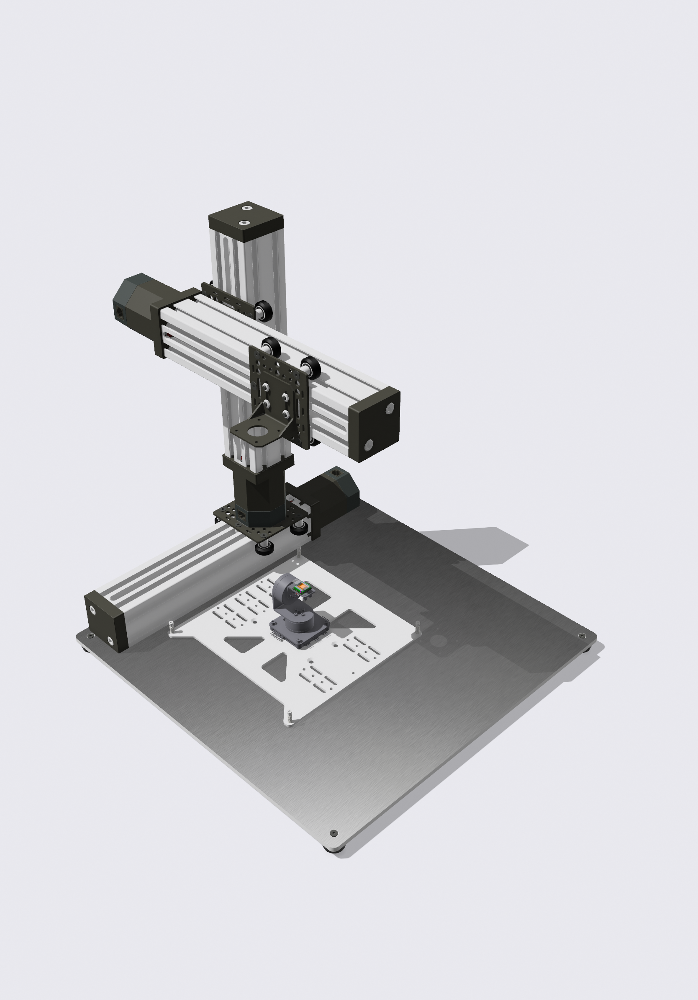

[English](README.md) · [العربية](i18n/README.ar.md) · [Español](i18n/README.es.md) · [Français](i18n/README.fr.md) · [日本語](i18n/README.ja.md) · [한국어](i18n/README.ko.md) · [Tiếng Việt](i18n/README.vi.md) · [中文 (简体)](i18n/README.zh-Hans.md) · [中文（繁體）](i18n/README.zh-Hant.md) · [Deutsch](i18n/README.de.md) · [Русский](i18n/README.ru.md)


> 🌐 **Multilingual status:** `i18n/` is present and reserved for language-specific README files. Linked localized documents are planned/in-progress.

<p align="center">
  
</p>

# Lazeal OptiX


<table width="100%">
  <tr>
    <td align="center" valign="middle" width="50%">
      
    </td>
    <td align="center" valign="middle" width="50%">
      
    </td>
  </tr>
</table>

*Prototype for Individual Use (left) and Institutional Use (right)*

## Overview

Lazeal OptiX is an innovative healthcare technology project. The core of the project is the development of a device that offers advanced diagnostics to users in the comfort of their homes. Using advanced microscopy and biochemical analysis techniques, the device aims to facilitate the early detection of a variety of health issues, contributing to improved healthcare outcomes.

The Lazeal OptiX project is born out of a commitment to reducing suffering and making health diagnostics more accessible to all. By equipping individuals with the tools they need to take control of their health, we strive to help create a healthier society.

The repository is currently research/prototype-oriented and notebook-centric. Most implementation details and experiments are tracked in Jupyter notebooks under `notebooks/`.

### At a Glance

| Area | Current Status |
|---|---|
| Project maturity | Research prototype |
| Primary execution model | Jupyter notebook workflows |
| Main experiment domains | Reconstruction, light source localization, multiple-image matching |
| Packaging/CI at root | Not currently declared |
| Multilingual docs | `i18n/` directory scaffold exists |

## Features

1. **Advanced Microscopy:** Leveraging advanced microscopy techniques for detailed analysis.
2. **Biochemical Analysis:** In-depth biochemical analysis enables detection of various health indicators.
3. **User-Friendly:** Designed for home use, offering a simple and accessible user interface.
4. **Compact and Affordable:** Lazeal OptiX is compact and affordably priced, bringing advanced diagnostics to everyday users.
5. **Lensless Reconstruction Workflows:** Notebook-based computational imaging and reconstruction pipelines.
6. **Light Source Localization Experiments:** Optimization notebooks for light source position estimation.
7. **Multiple-Image Matching Utilities:** Notebook and C++ OpenCV workflows for feature matching/alignment.

## Repository Structure

```text
lazealoptix/
├── README.md
├── prototype_individual.jpg
├── prototype_institute.png
├── figs/
│   ├── banner.svg|png
│   ├── logo.svg|png
│   └── logo-w-text.svg|png
├── camera/
│   └── README.md
├── light_source/
│   └── README.md
├── reconstruction/
│   └── README.md
├── three_axis_cnc/
│   └── README.md
├── notebooks/
│   ├── light_source_location/
│   ├── multiple_match/
│   └── reconstruction/
└── i18n/
```

### Module Notes

- `camera/`: scripts/resources related to camera usage for high-resolution sample capture.
- `light_source/`: scripts/resources for light source control and optimization.
- `reconstruction/`: scripts/resources for computational reconstruction.
- `three_axis_cnc/`: scripts/resources for three-axis CNC positioning/control.
- `notebooks/`: primary technical workspace for experiments and methods.

## Notebooks

The `notebooks` directory contains Jupyter notebooks that document various aspects of the Lazeal OptiX project. These notebooks include code, visualizations, and detailed explanations of the project's methodologies. They serve as an interactive way to explore and understand the project.

### `light_source_location`

The `light_source_location` directory contains notebooks related to the estimation of light source locations. These notebooks feature algorithms and methods used to accurately estimate the position of the light source, which is a crucial aspect of the Lazeal OptiX project.

### `multiple_match`

The `multiple_match` directory contains notebooks and scripts related to the matching of multiple images or patterns. This part of the project involves complex algorithms to accurately match and align images, which is necessary for the reconstruction of high-resolution images from the lensless imaging system.

### `reconstruction`

The `reconstruction` directory contains notebooks related to the reconstruction of images captured by the Lazeal OptiX device. These notebooks document the advanced computational techniques used to reconstruct high-resolution images from the lensless imaging system.

## Prerequisites

- OS: Linux/macOS recommended for current notebook and OpenCV workflows.
- Python: The provided environment file targets **Python 3.7**.
- Conda: Required to reproduce the documented `lensless` environment.
- Jupyter Notebook/Lab.
- Optional C++ toolchain for `multiple_match.cpp`:
  - `g++` with C++17 support.
  - OpenCV 4.x with contrib modules (`opencv2/xfeatures2d.hpp` / SIFT).

## Installation

### 1) Clone

```bash
git clone https://github.com/lachlanchen/lazealoptix.git
cd lazealoptix
```

### 2) Create the notebook environment (recommended)

```bash
conda env create -f notebooks/reconstruction/lensless.yaml
conda activate lensless
```

### 3) Start Jupyter

```bash
jupyter notebook
```

## Usage

This repository is primarily used by opening notebooks and running cells in sequence.

### Reconstruction track

- Open `notebooks/reconstruction/dataset_prep.ipynb` for dataset preparation.
- Open `notebooks/reconstruction/lensless-dropout-one-led-mahuichong.ipynb` for reconstruction/training experiments.

### Light source localization track

- Open notebooks under `notebooks/light_source_location/`.

### Multiple match track

- Open notebooks under `notebooks/multiple_match/`.
- Optional C++ utility: `notebooks/multiple_match/multiple_match.cpp`.

## Configuration

### Conda environment

Primary environment specification lives at:

- `notebooks/reconstruction/lensless.yaml`

Notable dependency signals from this file include:

- `python=3.7`
- `pytorch=1.9.0`
- `pyro-ppl`
- `opencv`-adjacent computer vision workflow dependencies in notebooks

### Data and paths

- **Assumption:** notebooks expect local datasets/files that are not centrally declared at repository root.
- **Assumption:** the C++ matching utility expects an `all/` directory (relative to its execution path) containing grayscale-readable images.

If your local setup differs, update notebook path cells and the C++ input directory accordingly.

## Examples

### Run the matching utility (example)

```bash
cd notebooks/multiple_match
g++ -std=c++17 multiple_match.cpp -o multiple_match `pkg-config --cflags --libs opencv4`
./multiple_match
```

Expected behavior:

- Reads images from `all/`
- Computes chained SIFT-based matches across images
- Writes an output image named like `result_<timestamp>.png`

### Launch a specific notebook

```bash
conda activate lensless
jupyter notebook notebooks/reconstruction/dataset_prep.ipynb
```

## Development Notes

- The repository currently has no root-level packaging (`pyproject.toml`, `requirements.txt`, or `setup.py`) and no CI/test harness at root.
- Work is experiment-first: notebooks are source-of-truth for most algorithms.
- `camera/`, `light_source/`, `reconstruction/`, and `three_axis_cnc/` currently provide high-level module descriptions and can be expanded with runbooks over time.
- `i18n/` exists and is reserved for multilingual README variants.

## Troubleshooting

- **Conda solve issues:** update Conda and retry environment creation.
- **Kernel mismatch in notebooks:** ensure the active kernel matches `lensless` where required.
- **OpenCV/SIFT compile errors:** install OpenCV contrib modules and verify `opencv2/xfeatures2d.hpp` availability.
- **Notebook file-not-found errors:** check dataset paths and relative directories expected by notebook cells.
- **C++ matcher reads no images:** verify `notebooks/multiple_match/all/` exists and contains valid image files.

## Roadmap

- Expand module-level runbooks in `camera/`, `light_source/`, `reconstruction/`, and `three_axis_cnc/`.
- Document dataset contracts and provide reproducible sample data pointers.
- Add reproducible scripts for key notebook pipelines.
- Add test/validation checks for reconstruction and matching outputs.
- Complete multilingual README files under `i18n/`.

## Getting Involved

We welcome collaboration and contributions. If you're interested in getting involved with the Lazeal OptiX project, feel free to submit an issue or a pull request, or contact us directly.

## Contributing

1. Fork the repository.
2. Create a feature branch.
3. Keep changes scoped and documented (especially for notebooks).
4. Open a pull request describing motivation, method, and validation.

If you plan major hardware/protocol changes, opening an issue first is recommended for alignment.

## Support

No dedicated funding/sponsorship metadata is currently declared in this repository.

If this changes, sponsorship and donation details should be added here without removing existing technical documentation.

## License

No license file is currently present in the repository root.

**Assumption/Action needed:** add a `LICENSE` file and update this section with the exact SPDX identifier.

## Contact

For further inquiries or collaboration interests, please reach out at `contact@lazealoptix.com`.
